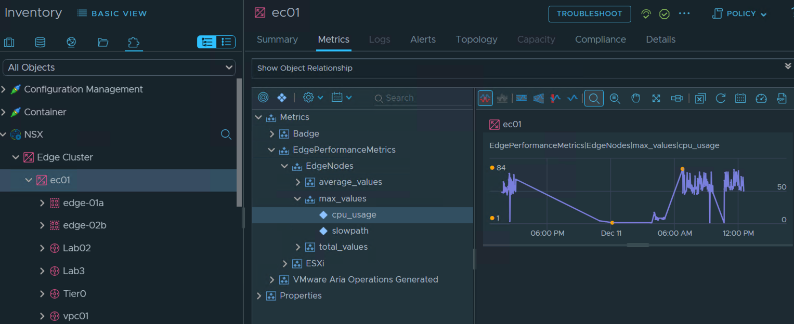
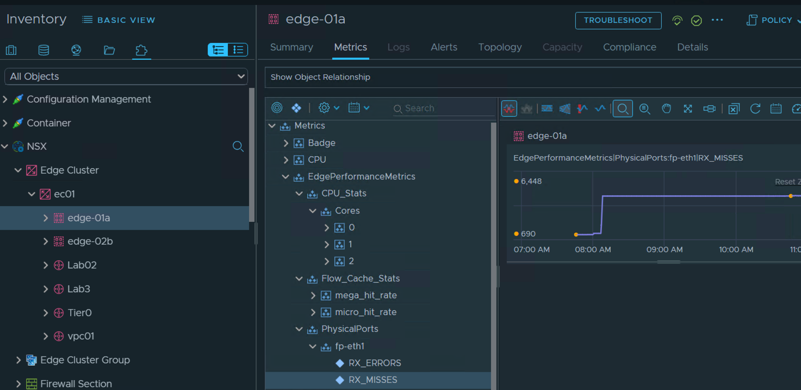
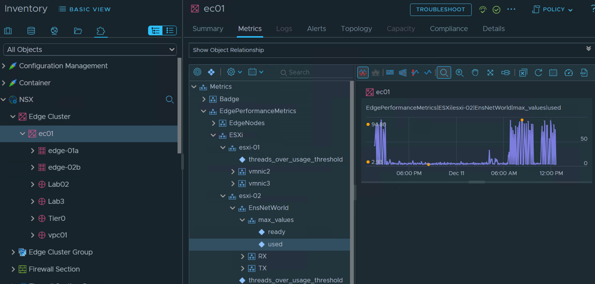
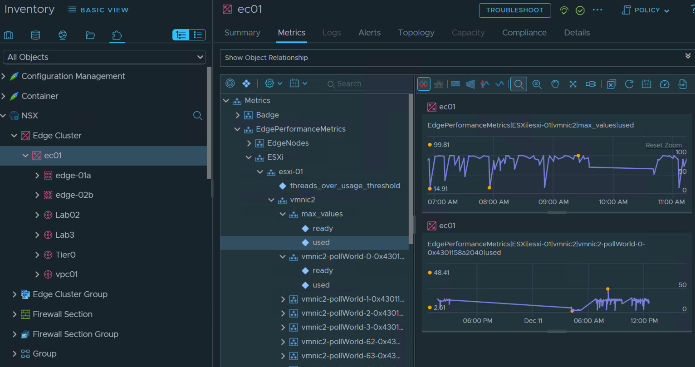

# NSX Edge and ESXi Network Performance Monitoring Solution

## Table of Contents
- [Overview](#overview)
  - [Supported Versions](#supported-versions)
- [Main Goals](#main-goals)
  - [Comprehensive Performance Monitoring](#1-comprehensive-performance-monitoring)
  - [Centralized Metrics Management](#2-centralized-metrics-management)
  - [Performance Threshold Monitoring](#3-performance-threshold-monitoring)
- [Architecture](#architecture)
  - [Core Components](#core-components)
  - [Data Collection Details](#data-collection-details)
- [Configuration](#configuration)
  - [Edge Node Configuration](#edge-node-configuration)
  - [Requirements Configuration](#requirements-configuration)
- [Metric Details](#metric-details)
  - [Edge Node Metrics](#edge-node-metrics)
  - [ESXi Metrics](#esxi-metrics)
- [Operational Details](#operational-details)
  - [Thread Filtering](#thread-filtering)
  - [Logging System](#logging-system)
  - [vROPs Integration](#vrops-integration)
  - [Security Considerations](#security-considerations)
- [Detailed Collection Process](#detailed-collection-process)
  - [Edge Node Collection Commands](#edge-node-collection-commands)
  - [ESXi Collection Command](#esxi-collection-command)
- [Edge Node Collector Output Structure](#edge-node-collector-output-structure)
  - [Data Collection Process](#data-collection-process)
- [ESXi Collector Output Structure](#esxi-collector-output-structure)
  - [Data Collection Process](#data-collection-process-1)
  - [Thread Filtering](#thread-filtering-1)
- [Statistics Processing in Main Script](#statistics-processing-in-main-script)
  - [Edge Node Statistics Processing](#edge-node-statistics-processing)
  - [ESXi Statistics Processing](#esxi-statistics-processing)
  - [Combined Processing](#combined-processing)
  - [Metric Path Structure](#metric-path-structure)
- [Logging Examples](#logging-examples)
  - [Edge Node Collector Output](#edge-node-collector-output)
  - [ESXi Collector Output](#esxi-collector-output)
- [Thread Processing](#thread-processing)
  - [Thread Filtering Logic](#thread-filtering-logic)
  - [Thread Types and Patterns](#thread-types-and-patterns)
- [vROPs Metric Structure](#vrops-metric-structure)
  - [Metric Key Format](#metric-key-format)
- [Error Notification System](#error-notification-system)
  - [Notification Format](#notification-format)
  - [Common Error Scenarios](#common-error-scenarios)
- [Performance Considerations](#performance-considerations)
  - [Timing](#timing)
- [Setup Steps](#setup-steps)
  - [Create Log File](#1-create-log-file)
  - [Add to Crontab](#2-add-to-crontab)
  - [Verify Operation](#3-verify-operation)
- [vROPs Metric Visualization](#vrops-metric-visualization)
  - [Finding the NSX Adapter ID](#finding-the-nsx-adapter-id)
  - [Metric Organization](#metric-organization)

## Overview
This project implements an automated solution for collecting, processing, and monitoring network performance metrics from both NSX Edge nodes and ESXi hosts in a virtualized environment. The collected metrics are then published to VMware Aria Operations (vROps) for monitoring and analysis.

The code has been developed and tested on the following product versions:
- NSX 4.2.1
- ESXi 8.0u3
- Aria Operations 8.18.2

## Main Goals

### 1. Comprehensive Performance Monitoring
- Collect detailed performance metrics from NSX Edge nodes and ESXi hosts
- Monitor CPU utilization, interface statistics, and flow cache performance
- Track network-related thread activities and resource usage

### 2. Centralized Metrics Management
- Aggregate performance data from multiple sources
- Normalize and process metrics for consistent reporting
- Push consolidated metrics to vROps for centralized monitoring

### 3. Performance Threshold Monitoring
- Track CPU usage against defined thresholds
- Monitor interface errors and network flow statistics
- Identify potential performance bottlenecks

## Architecture

### Core Components

#### 1. Main Orchestrator (`getEdgeNodeStatsMainScript.py`)
- Central coordination script that manages the overall metrics collection and publishing process
- Implements the `StatsCollector` class which orchestrates:
  - Sequential collection of metrics from Edge nodes and ESXi hosts
  - Processing and normalization of collected data
  - Publishing metrics to vROps
  - Error handling and notification management

#### 2. Edge Node Collector (`getAllStatsFromEdgeNode.py`)
- Implements `NSXEdgeStatsCollector` class for collecting metrics from NSX Edge nodes
- Gathers:
  - CPU performance statistics
  - Interface metrics
  - Flow cache statistics
- Handles SSH connections and command execution on Edge nodes

#### 3. ESXi Collector (`getAllStatsFromESXi.py`)
- Implements `ESXiStatsCollector` class for collecting metrics from ESXi hosts
- Collects:
  - Network interface statistics (vmnic stats)
  - Thread performance metrics
  - EnsNetWorld statistics
- Manages SSH connections to ESXi hosts

#### 4. Support Modules
- `requestvROpsAccessToken.py`: vROps authentication
- `edge_node_config_reader.py`: Configuration file parsing
- `sendNotificationOnError.py`: Error notification system

## Data Collection Details

### Edge Node Collection
1. Connects to each Edge node via SSH
2. Executes `get interfaces | json` to collect interface statistics
3. Executes `get dataplane perfstats {interval}` to collect performance metrics
4. Processes and aggregates the data
5. Calculates maximum values across all nodes

### ESXi Collection
1. Connects to each ESXi host in the cluster via SSH
2. Executes `net-stats -i 1 -tW -A` to collect network statistics
3. Processes statistics for:
   - VMNIC poll world threads
   - EnsNetWorld TX/RX threads
4. Calculates maximum values across all hosts

## Configuration

### Edge Node Configuration File (`edge_node_config.yaml`)
```yaml
edge_nodes:
  "18b3dd22-2ba6-482a-80a3-eb90068dfb2d": "10.191.21.93"  # Edge Node UUID: IP address
  "e5b7ce1b-4210-46dd-a3f9-38bd1c71e332": "10.191.21.97"  # Edge Node UUID: IP address

edge_clusters:
  "2ebffbe1-8aca-46de-919a-cf606c15ed82":    # Edge Cluster UUID
    esxi_hosts:
      "esxi-01": "10.163.183.151"            # ESXi hostname: IP address
      "esxi-02": "10.163.183.152"            # ESXi hostname: IP address
```

Configuration Requirements:
- Edge Node UUIDs must be obtained from NSX Manager for the nodes to be monitored
- Edge Cluster UUID must match the NSX Edge Cluster UUID containing the monitored nodes
- ESXi hosts should include all possible hosts where the Edge nodes could run
- All IP addresses must be reachable from the monitoring server

### Requirements Configuration (`requirements.py`)
```python
requirement = {
    "nsx_manager": {
        "ip": "<nsx_manager_ip>",
        "credential": {
            "username": "admin",
            "password": "****"
        }
    },
    "nsx_edge_nodes": {
        "credential": {
            "username": "admin",
            "password": "****"
        }
    },
    "esxi_hosts": {
        "credential": {
            "username": "root",
            "password": "****"
        }
    },
    "vrops_instance": {
        "ip": "<vrops_ip>",
        "credential": {
            "username": "admin",
            "password": "****"
        },
        "adapterInstanceId": "<adapter_instance_id>"  # From vROPs UI: Inventory->Adapters
    }
}
```

## Metric Details

### Edge Node Metrics

#### 1. Interface Statistics
For each interface (fp-eth0 through fp-eth3):
- `rx_errors`: Number of receive errors
- `rx_misses`: Number of receive packet misses
- `tx_errors`: Number of transmission errors

#### 2. CPU Performance
For each CPU core:
- `usage`: CPU utilization percentage
- `rx`: Receive packet rate (packets per second)
- `tx`: Transmit packet rate (packets per second)
- `crypto`: Cryptographic operations rate
- `slowpath`: Slow path packet processing rate
- `intercore`: Inter-core communication rate

#### 3. Flow Cache Statistics
For each core:
- `micro_hit_rate`: Micro flow cache hit rate percentage
- `mega_hit_rate`: Mega flow cache hit rate percentage

### ESXi Metrics

#### 1. VMNIC Statistics
For each vmnic:
- `max_used`: Maximum CPU usage percentage across all threads
- `max_ready`: Maximum ready time percentage
- Thread-specific statistics:
  - `used`: CPU usage percentage per thread
  - `ready`: Ready time percentage per thread

#### 2. EnsNetWorld Statistics
Tracks network processing threads divided into:
- TX (Transmit) threads
- RX (Receive) threads

Each thread includes:
- `used`: CPU usage percentage
- `ready`: Ready time percentage

## Operational Details

### Thread Filtering
The ESXi collector implements thread filtering to focus on significant resource usage:
- Only threads with CPU usage above a configurable threshold are collected
- Default threshold is 2% CPU usage
- Filtering applies to both VMNIC and EnsNetWorld threads
- Reduces noise in metrics by excluding low-activity threads

### Logging System

#### Configuration
Both collectors implement comprehensive logging with:
- Standard output (console) logging
- File logging to 'edge_monitoring.log'
- Configurable verbose mode

#### Verbose Mode
Enable verbose logging by initializing collectors with:
```python
collector = NSXEdgeStatsCollector(verbose=True)
collector = ESXiStatsCollector(verbose=True)
```

### vROPs Integration

1. Adapter Instance ID
   - Found in vROPs UI under Inventory -> Adapters
   - Required for metric publishing and notifications
   - Must be from an active NSX-T adapter instance

2. Authentication
   - Uses token-based authentication
   - Tokens are managed by the `requestvROpsAccessToken.py` module

3. Error Handling
   - Failed collections trigger notifications in vROPs
   - Notifications include detailed error messages
   - Can be viewed in vROPs alerts and notifications panel

### Security Considerations

1. Credential Management
   - Credentials are stored in `requirements.py`
   - File should have restricted permissions
   - Consider using environment variables or a secure vault in production

2. Network Access
   - Monitoring server needs SSH access to Edge nodes and ESXi hosts
   - HTTPS access required for vROPs API
   - Firewall rules should be configured accordingly
  
## Detailed Collection Process

### Edge Node Collection Commands
1. Interface Statistics Command:
   ```bash
   get interfaces | json
   ```
   - Collects raw interface metrics
   - JSON format for easy parsing
   - Includes all physical ports

2. Performance Statistics Command:
   ```bash
   get dataplane perfstats 1
   ```
   - 1-second sampling interval (Configurable)
   - Includes CPU and flow cache metrics
   - Real-time performance data

### ESXi Collection Command
```bash
net-stats -i 1 -tW -A
```
Parameters:
- `-i 1`: 1-second sampling interval
- `-t`: Include thread statistics
- `-W`: Wide output format
- `-A`: All statistics

## Edge Node Collector Output Structure

The Edge Node collector produces a nested dictionary structure containing metrics from all monitored Edge nodes:

```python
{
  "nodes": {
    "18b3dd22-2ba6-482a-80a3-eb90068dfb2d": {    # Edge Node UUID
      "interfaces": {
        "fp-eth0": {                              # Interface name
          "rx_errors": 0.0,
          "rx_misses": 0.0,
          "tx_errors": 0.0
        },
        "fp-eth1": {
          "rx_errors": 76421.0,                   # Cumulative error count
          "rx_misses": 6448.0,
          "tx_errors": 0.0
        }
      },
      "performance": {
        "cpu_stats": {
          "0": {                                  # Core ID
            "usage": 5.0,                         # Percentage
            "rx": 17130.0,                        # Packets/sec
            "tx": 17130.0,
            "crypto": 0.0,
            "slowpath": 0.0,
            "intercore": 0.0
          }
        },
        "flow_cache_stats": {
          "micro_hit_rate": {                     # Per core hit rates
            "0": 100.0,
            "1": 100.0,
            "2": null
          },
          "mega_hit_rate": {
            "0": 6.0,
            "1": 10.0,
            "2": null
          }
        }
      }
    }
  },
  "max_values": {                                # Maximum values across all nodes
    "interfaces": {
      "rx_errors": 76421.0,
      "rx_misses": 6448.0,
      "tx_errors": 0.0
    },
    "cpu": {
      "usage": 58.0,
      "crypto": 0.0,
      "slowpath": 20.0,
      "intercore": 0.0
    },
    "flow_cache": {
      "micro_hit_rate": 100.0,
      "mega_hit_rate": 2.0
    }
  }
}
```

### Data Collection Process
1. Interface Statistics:
   - Collected via `get interfaces | json` command
   - Parsed from JSON response
   - Accumulated error and miss counts stored

2. Performance Statistics:
   - Collected via `get dataplane perfstats {interval}` command
   - CPU metrics sampled over specified interval
   - Flow cache statistics gathered per core

3. Maximum Values:
   - Calculated across all nodes during processing
   - Updated for each metric category
   - Stored in top-level max_values section

## ESXi Collector Output Structure

The ESXi collector produces a structure focusing on thread-level statistics:

```python
{
  "hosts": {
    "esxi-01": {                                # ESXi hostname
      "vmnic_stats": {
        "vmnic2": {                            # Network interface
          "max_used": 99.52,                   # Maximum CPU usage
          "max_ready": 0.29,                   # Maximum ready time
          "threads": {
            "vmnic2-pollWorld-0-0x4301158a2040": {
              "used": 26.17,                   # Current CPU usage
              "ready": 0.21                    # Current ready time
            }
          }
        }
      }
    },
    "esxi-02": {
      "vmnic_stats": {
        "ens": {                               # EnsNetWorld metrics
          "max_used": 92.33,
          "max_ready": 2.88,
          "tx": {                              # Transmit threads
            "threads": {
              "EnsNetWorld-0-1": {
                "used": 5.96,
                "ready": 0.52
              }
            }
          },
          "rx": {                              # Receive threads
            "threads": {
              "EnsNetWorld-0-0": {
                "used": 71.82,
                "ready": 2.88
              }
            }
          }
        }
      }
    }
  },
  "max_values": {                              # Cluster-wide maximums
    "used": 99.52,
    "ready": 2.88
  }
}
```

### Data Collection Process
1. Thread Statistics:
   - Collected via `net-stats -i 1 -tW -A` command
   - Filtered for threads above usage threshold (default 2%)
   - Separated into VMNIC and EnsNetWorld categories

2. VMNIC Processing:
   - Identifies pollWorld threads per interface
   - Tracks CPU usage and ready time
   - Calculates maximum values per interface

3. EnsNetWorld Processing:
   - Separates TX and RX threads
   - Thread ID pattern determines type:
     - Odd numbers: TX threads
     - Even numbers: RX threads
   - Maintains maximum values per direction

4. Maximum Values:
   - Calculated across all hosts
   - Updated for both used and ready metrics
   - Represents cluster-wide peak values

### Thread Filtering
- Only threads exceeding the usage threshold are included
- Default threshold is 2% CPU usage
- Reduces noise in collected metrics
- Focuses on significant resource consumers

## Statistics Processing in Main Script

### Edge Node Statistics Processing

#### Method: `_process_edge_stats(stats, timestamp)`

This method transforms raw Edge Node statistics into vROPs metric format.

```python
def _process_edge_stats(self, stats: Dict[str, Any], timestamp: int) -> list:
```

#### Processing Steps

1. **CPU Statistics**
```python
# For each core in cpu_stats
metrics.append({
    'statKey': f'EdgePerformanceMetrics|CPU_Stats|Cores:{core}|{stat_name.upper()}',
    'timestamps': [timestamp],
    'data': [value]
})
```
- Processes each core's metrics separately
- Transforms raw values into time-series data points
- Includes: usage, rx, tx, crypto, slowpath, intercore

2. **Flow Cache Statistics**
```python
# For each cache type (micro/mega) and core
if hit_rate is not None and hit_rate > 0:
    metrics.append({
        'statKey': f'EdgePerformanceMetrics|Flow_Cache_Stats|{cache_type}|Core:{core}',
        'timestamps': [timestamp],
        'data': [hit_rate]
    })
```
- Filters out null and zero values
- Processes both micro and mega cache hit rates
- Maintains per-core statistics

3. **Interface Statistics**
```python
# For each interface and metric
if value > 0:
    metrics.append({
        'statKey': f'EdgePerformanceMetrics|PhysicalPorts:{interface}|{stat_name.upper()}',
        'timestamps': [timestamp],
        'data': [value]
    })
```
- Only includes non-zero values
- Tracks rx_errors, rx_misses, tx_errors
- Maintains historical data per interface

### ESXi Statistics Processing

#### Method: `_process_esxi_stats(stats, timestamp)`

Processes ESXi host statistics with focus on thread performance.

```python
def _process_esxi_stats(self, stats: Dict[str, Any], timestamp: int) -> list:
```

#### Processing Steps

1. **Thread Counting and Filtering**
```python
# Count threads over threshold for each host
if thread_stats.get('used', 0) > self.usage_threshold:
    host_threads_over_threshold += 1
    metrics.append({
        'statKey': f'EdgePerformanceMetrics|ESXi|{host_id}|threads_over_usage_threshold',
        'timestamps': [timestamp],
        'data': [host_threads_over_threshold]
    })
```
- Counts threads exceeding usage threshold per host
- Default threshold: 2% CPU usage
- Generates thread count metrics

2. **VMNIC Thread Processing**
```python
# Process VMNIC threads
if vmnic_data.get('max_used', 0) > 0:
    metrics.append({
        'statKey': f'EdgePerformanceMetrics|ESXi|{host_id}|{vmnic}|max_values|used',
        'timestamps': [timestamp],
        'data': [vmnic_data['max_used']]
    })
```
- Processes each VMNIC's maximum usage
- Tracks ready time statistics
- Filters based on activity threshold

3. **EnsNetWorld Thread Processing**
```python
# Process TX/RX threads separately
for thread_name, thread_stats in ens_data.get('tx', {}).get('threads', {}).items():
    if thread_stats.get('used', 0) > 0:
        metrics.append({
            'statKey': f'EdgePerformanceMetrics|ESXi|{host_id}|EnsNetWorld|TX|{thread_name}|used',
            'timestamps': [timestamp],
            'data': [thread_usage]
        })
```
- Separates TX and RX threads
- Maintains directional statistics
- Tracks individual thread performance

#### Combined Processing

```python
def collect_cluster_metrics(self, edge_stats, esxi_stats, timestamp):
```

The main script combines metrics from both collectors:

1. **Edge Maximum Values**
```python
edge_max_values = {
    'cpu_usage': 0.0,
    'crypto': 0.0,
    'slowpath': 0.0,
    'intercore': 0.0
}
```
- Tracks peak values across all Edge nodes
- Updates maximum values for each metric type
- Maintains historical trends

2. **Flow Cache Aggregation**
```python
flow_cache_totals = {
    'micro_hit_rate': {'sum': 0.0, 'count': 0},
    'mega_hit_rate': {'sum': 0.0, 'count': 0}
}
```
- Calculates average hit rates
- Excludes inactive cores
- Provides cluster-wide cache performance metrics

3. **Interface Totals**
```python
interface_totals = {
    'rx_misses': 0.0,
    'tx_errors': 0.0
}
```
- Sums error counts across interfaces
- Tracks total packet misses
- Monitors overall interface health

#### Metric Path Structure

The processed statistics follow these path patterns:

1. Edge Node Metrics:
```
EdgePerformanceMetrics|EdgeNodes|max_values|<metric>
EdgePerformanceMetrics|PhysicalPorts|<interface>|<metric>
EdgePerformanceMetrics|Flow_Cache_Stats|<type>|Core:<id>
```

2. ESXi Metrics:
```
EdgePerformanceMetrics|ESXi|<host>|<vmnic>|max_values|<metric>
EdgePerformanceMetrics|ESXi|<host>|EnsNetWorld|<direction>|<thread>|<metric>
EdgePerformanceMetrics|ESXi|max_values|<metric>
```

#### Final Output
The processed metrics are formatted for vROPs ingestion:
```python
{
    'id': resource_id,
    'stat-contents': [
        {
            'statKey': metric_path,
            'timestamps': [timestamp],
            'data': [value]
        }
        # ... additional metrics
    ]
}
```

This processed data structure enables:
- Historical tracking of performance metrics
- Aggregated views of cluster performance
- Detailed thread-level analysis
- Threshold-based monitoring

## Logging Examples

### Edge Node Collector Output
```
2024-12-11 19:17:25,952 - INFO - NSX Edge Stats Collector initialized
2024-12-11 19:17:25,953 - INFO - Found 2 edge nodes in configuration
2024-12-11 19:17:25,953 - INFO - Starting collection of all edge node statistics
2024-12-11 19:17:25,953 - INFO - Processing node: 18b3dd22-2ba6-482a-80a3-eb90068dfb2d
```

### ESXi Collector Output
```
2024-12-11 19:17:36,326 - INFO - ESXi Stats Collector initialized
2024-12-11 19:17:36,326 - INFO - Found 1 edge clusters in configuration
2024-12-11 19:17:36,326 - INFO - Found 2 ESXi hosts in cluster
```

## Thread Processing

### Thread Filtering Logic
```python
USAGE_THRESHOLD = 2.0  # Default 2% threshold

if thread_stats.get('used', 0) > USAGE_THRESHOLD:
    metrics.append({
        'statKey': f'EdgePerformanceMetrics|ESXi|{host_id}|{thread_name}|used',
        'timestamps': [timestamp],
        'data': [thread_usage]
    })
```

### Thread Types and Patterns

1. VMNIC Poll World Threads
   - Format: `vmnic<X>-pollWorld-<ID>-<ADDR>`
   - Example: `vmnic2-pollWorld-65-0x4301158d7d80`
   - Indicates NIC polling threads

2. EnsNetWorld Threads
   - Format: `EnsNetWorld-<GROUP>-<ID>`
   - Example: `EnsNetWorld-0-1`
   - Even IDs: RX threads
   - Odd IDs: TX threads

## vROPs Metric Structure

### Metric Key Format
```
EdgePerformanceMetrics|<Component>|<Host/Node>|<Metric>
```

Example metric paths:
```
EdgePerformanceMetrics|ESXi|esxi-01|vmnic2|threads_over_usage_threshold
EdgePerformanceMetrics|EdgeNodes|max_values|cpu_usage
```

## Error Notification System

### Notification Format
```python
suite_api_json = {
    "eventType": "NOTIFICATION",
    "cancelTimeUTC": 0,
    "severity": "WARNING",
    "keyIndicator": False,
    "managedExternally": False,
    "resourceId": adapter_instance_id,
    "message": error_message,
    "startTimeUTC": current_time_in_millis
}
```

### Common Error Scenarios
1. SSH Connection Failures
   ```
   Failed to connect to node {node_id} ({ip}): Connection timed out
   ```

2. Authentication Failures
   ```
   Authentication failed for host {host_id}
   ```

3. Command Execution Errors
   ```
   Error executing command '{command}' on node {node_id}: {error}
   ```

## Performance Considerations

### Timing
- Edge Node collection: ~2-3 seconds per node
- ESXi collection: ~1-2 seconds per host
- vROPs publication: ~1 second per batch

## Setup Steps

### 1. Create Log File
```bash
# Create log file
sudo touch /var/log/edge_monitoring.log
sudo chmod 666 /var/log/edge_monitoring.log
```

### 2. Add to Crontab
```bash
# Open crontab editor
crontab -e

# Add this line to run every minute (replace /path/to with your actual path)
* * * * * cd /path/to/ScriptsFolder && python3 getEdgeNodeStatsMainScript.py >> /var/log/edge_monitoring.log 2>&1
```

### 3. Verify Operation
```bash
# Check if script is running (shows recent log entries)
tail -f /var/log/edge_monitoring.log

# Check cron logs if there are issues
grep CRON /var/log/syslog
```
# vROPs Metric Visualization

## Finding the NSX Adapter ID

The NSX adapter instance ID (highlighted in red) can be found in vROPs under:
- Navigate to: Inventory Management -> Adapter Instances
- Look for the NSX adapter entry
- The ID will be a UUID format like: "8e434d15-a29b-4776-aea3-bb21bc5c2c2f"

## Metric Organization

The collected metrics are organized hierarchically in vROPs under the Edge Cluster object:

### Edge Node Level Metrics

- Located under EdgePerformanceMetrics/EdgeNodes
- Shows cluster-wide metrics including:
  - Maximum CPU usage across nodes
  - Peak values over time
  - CPU utilization trends

### Physical Interface Metrics

- Found under EdgePerformanceMetrics/PhysicalPorts
- Per-interface statistics including:
  - RX_MISSES counter
  - RX_ERRORS counter
  - Shows historical trends of packet drops and errors

### ESXi Host Metrics

- Located under EdgePerformanceMetrics/ESXi
- EnsNetWorld thread statistics:
  - CPU usage per thread
  - Ready time metrics
  - Thread utilization trends

### Individual Thread Metrics

- Detailed view of individual VMNIC threads
- Shows:
  - Per-thread CPU usage
  - Maximum values over time
  - Thread-specific performance data
  - Historical trending of thread utilization


